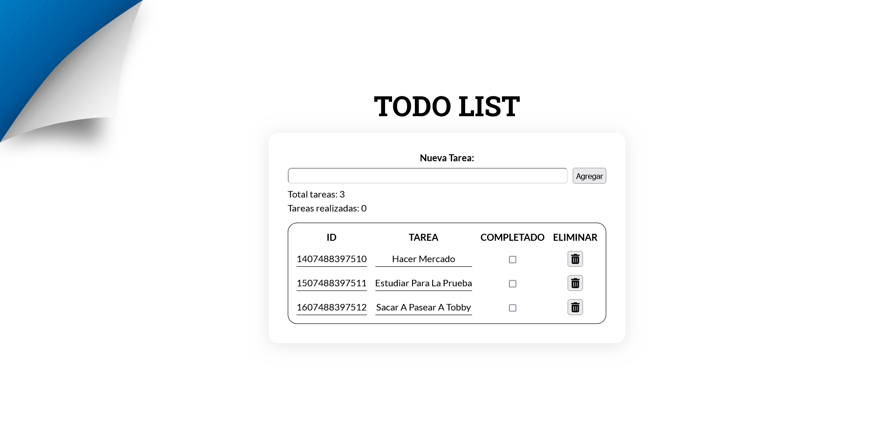

# Desafío 5 - Todo List ✅

En este desafío, he aplicado los conocimientos adquiridos para crear una página web que permita mantener un control de tareas pendientes.

## Descripción del Desafío 📝

He implementado una lista de tareas dinámica donde el usuario puede agregar, eliminar y marcar como completadas las tareas. La lista se actualiza en tiempo real en la página web.

## Capturas de Pantalla 🖼️

### Escritorio


## Requerimientos del Desafío 🎯

1. **Agregar Tareas:** Se permite agregar tareas a través de un input y un botón "Agregar tarea". La tarea se agrega al arreglo y la lista en la página web se actualiza automáticamente.

2. **Eliminar Tareas:** Se puede borrar una tarea haciendo clic en el botón de eliminar que acompaña a cada tarea. La tarea se elimina del arreglo y la lista en la página web se actualiza automáticamente.

3. **Conteo Total de Tareas:** Se muestra el total de tareas en la lista y se actualiza automáticamente al agregar o eliminar una tarea.

4. **Marcar Tareas como Completadas:** Se puede marcar una tarea como completada haciendo clic en un botón "Cambiar" o un checkbox. La tarea cambia su estado a completada y se actualiza la lista automáticamente.

## Solución a requerimientos 😉

1. **Agregar Tareas:**
```javascript
let addNewTask = () => {
    tareas.push({ id: Date.now(), tarea: input.value, estado: false })
    taskListUpdate()
    totalTasksInfo()
    input.value = ''
}
```
2. **Eliminar Tareas:**
```javascript
const deleteTask = (taskId) => {
    let taskIndex = tareas.findIndex(task => task.id === taskId)
    tareas.splice(taskIndex, 1)
    taskList()
}
```
3. **Conteo Total de Tareas:**
```javascript
let totalTasksInfo = () => {
    totalTasksResume = tareas.length
    totalTasks.innerHTML = totalTasksResume
}
```
4. **Marcar Tareas como Completadas:**
```javascript
let updateCompletedTask = (taskId) => {
    let taskIndex = tareas.findIndex(task => task.id === taskId)
    if (tareas[taskIndex].estado === false) {
        tareas[taskIndex].estado = true
        totalCompletedTasksInfo()
    } else if (tareas[taskIndex].estado === true) {
        tareas[taskIndex].estado = false
        totalCompletedTasksInfo()
    }
}
```

## Estructura del Código 🧱

El código HTML proporciona la estructura básica de la página, incluyendo un input para agregar nuevas tareas, una tabla para mostrar las tareas, y se enlaza con el archivo JavaScript para la funcionalidad dinámica.

El código CSS proporciona estilos visuales para mejorar la apariencia de la página y hacerla más atractiva para el usuario.

El código JavaScript maneja la lógica de agregar, eliminar y marcar tareas como completadas, así como la actualización dinámica de la lista en la página web.

## Mejoras Futuras 🚀

En el futuro, podría considerar añadir funcionalidades adicionales como editar tareas, filtrar tareas por estado (completadas/no completadas), o agregar categorías a las tareas.

